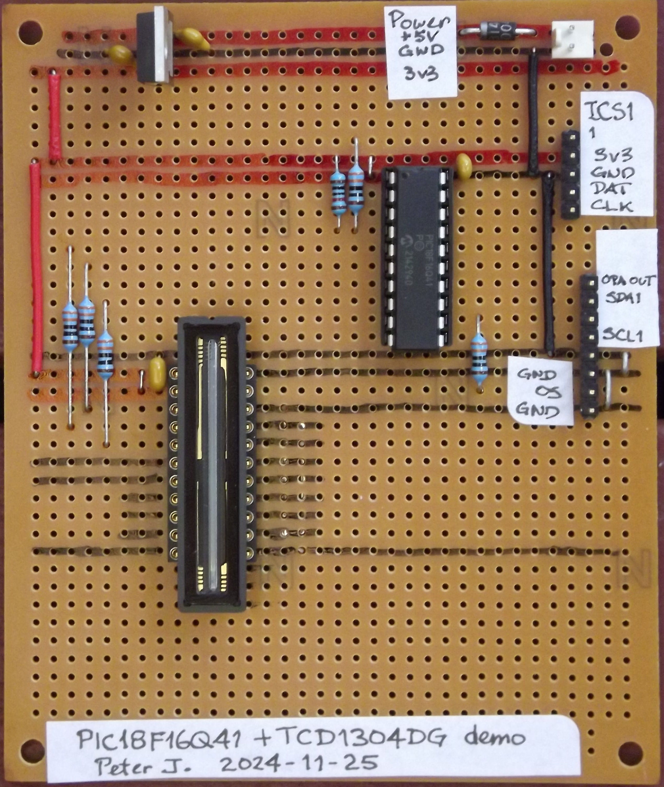

Introduction
------------

The care and feeding of the TCD1304DG linear image sensor is done in three parts.
A PIC18F16Q41 microcontroller drives the SH, ICG ande master clock pins of the 
sensor such that it outputs the pixel data as a time-varying analog voltage.
The RP2350 microcontroller on the Pico2 board samples that analog voltage and converts 
the pixel data into digital values, which are then sent (via the serial port) 
to a supervisory program that is running on a PC.

This repository holds the source code for the PIC18F16Q41 firmware.
The firmware for the Pico2 is in the repository:
https://github.com/pajacobs-ghub/pico2-TCD1304-reader

PIC18F16Q41 firmware
--------------------

We make use of the PWM1, PWM2 and PWM3 modules to drive the SH, ICG and 
master-clock pins synchronously.
We also use the operational amplifier module to buffer the analog voltage 
that is output by the sensor.

Once initialized, the microcontroller loops indefinitely but checks for incoming
data that can arrive via the I2C port.
(The I2C port is serviced via interrupts.)
If 4 bytes of data are received as a command, they are interpreted as the periods
for the SH and ICG signals and the three PWM channels are stopped and reinitialized
with the new periods.

Prototype hardware
------------------

Licence
-------
GPL3

